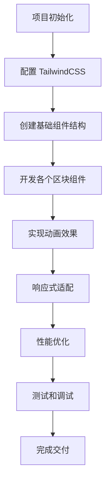

# Simple 网站复刻 - 技术架构文档

## 项目概述

复刻 [Simple](https://preview.cruip.com/simple/index.html) 网站，使用现代前端技术栈实现一个高度还原的单页应用。

## 技术栈

- **框架**: React 18 + TypeScript
- **构建工具**: Vite
- **样式**: TailwindCSS 3.x
- **图标**: Lucide React / Heroicons
- **动画**: Framer Motion
- **工具库**: clsx / tailwind-merge

## 设计系统

### 颜色方案

```typescript
// 主题色
primary: '#3B82F6'      // 蓝色
primaryDark: '#2563EB'  // 深蓝色
dark: '#1E293B'         // 深色背景
darkAlt: '#0F172A'      // 更深的背景
light: '#F8FAFC'        // 浅色背景
gray: '#64748B'         // 灰色文字
```

### 间距系统
- 容器最大宽度: 1280px
- 区块间距: 80px - 120px
- 卡片圆角: 12px - 16px

## 页面结构

```
App
├── Header (固定导航栏)
├── HeroSection (主标题区域)
├── CategoryTabs (分类标签)
├── BrandShowcase (品牌展示 + 连接动画)
├── Testimonial (客户评价)
├── TeamSection (团队协作 + 3D效果)
├── FeatureGrid (功能网格)
├── ValueSection (价值主张)
├── AdditionalFeatures (附加功能)
├── CustomerReviews (客户推荐卡片)
├── CTASection (行动号召)
└── Footer (页脚)
```

## 组件设计

### 1. Header 导航栏
```typescript
- Logo 组件
- 导航菜单（Pricing, Customers, Blog, Docs, Extra下拉）
- Login / Register 按钮
- 响应式菜单（移动端汉堡菜单）
- 滚动时添加背景模糊效果
```

### 2. Hero Section
```typescript
- 用户头像群组（6个头像，部分重叠）
- 渐变背景（浅灰到白色）
- 大标题动画
- 副标题
- CTA 按钮组（主按钮 + 次要按钮）
```

### 3. Brand Showcase
```typescript
- 品牌图标（GitHub, Simple Logo, Google等）
- SVG 连接线动画
- 使用 Framer Motion 实现路径动画
```

### 4. Team Section (3D 效果)
```typescript
- 深色渐变背景
- 3D 地球仪效果（使用 CSS 3D transform 或 Three.js 轻量实现）
- 协作者卡片动画
- 连接线效果
```

### 5. Feature Grid
```typescript
- 2x3 网格布局
- 每个卡片包含：图标 + 标题 + 描述
- 悬浮效果
- 深色背景 + 边框效果
```

### 6. Customer Reviews
```typescript
- 卡片布局（3列）
- 头像 + 名字 + 职位
- 评价内容
- 日期标记（Twitter图标）
- 响应式网格
```

### 7. CTA Section
```typescript
- 深色背景（带网格图案）
- 大标题
- CTA 按钮
- 背景装饰效果
```

### 8. Footer
```typescript
- 4列布局：Product, Company, Resources, Social
- Logo + 版权信息
- 社交媒体图标链接
- 响应式列布局
```

## 动画实现

### 滚动动画
```typescript
- 使用 Intersection Observer API
- Framer Motion 的 motion 组件
- 淡入 + 上移效果
- 错开动画时间
```

### 交互动画
```typescript
- 按钮悬浮：transform scale + 阴影变化
- 卡片悬浮：轻微上移 + 阴影增强
- 导航栏：滚动时背景模糊和阴影
- 连接线：路径绘制动画
```

## 响应式设计

### 断点
```typescript
sm: '640px'   // 移动端
md: '768px'   // 平板
lg: '1024px'  // 笔记本
xl: '1280px'  // 桌面
```

### 移动端适配
- 导航栏：汉堡菜单
- Hero：单列布局，字体缩小
- 功能网格：单列/双列
- 推荐卡片：单列滚动
- Footer：单列堆叠

## 性能优化

1. **图片优化**
   - 使用 WebP 格式
   - 懒加载非首屏图片
   - 合适的尺寸和压缩

2. **代码分割**
   - 按路由分割（如需要）
   - 动态导入重型组件

3. **CSS 优化**
   - PurgeCSS（TailwindCSS 内置）
   - 关键 CSS 内联

4. **动画性能**
   - 使用 transform 和 opacity
   - 避免触发重排的属性
   - will-change 优化

## 开发流程



## 目录结构

```
simple-clone/
├── public/
│   └── images/          # 图片资源
├── src/
│   ├── components/
│   │   ├── Header/
│   │   ├── Hero/
│   │   ├── BrandShowcase/
│   │   ├── Testimonial/
│   │   ├── TeamSection/
│   │   ├── FeatureGrid/
│   │   ├── CustomerReviews/
│   │   ├── CTASection/
│   │   └── Footer/
│   ├── hooks/           # 自定义 hooks
│   ├── utils/           # 工具函数
│   ├── types/           # TypeScript 类型
│   ├── App.tsx
│   └── main.tsx
├── tailwind.config.js
├── vite.config.ts
└── package.json
```

## 关键技术点

### 1. 品牌连接线动画
使用 SVG path + Framer Motion 的 pathLength 动画

### 2. 3D 地球仪效果
- 选项A: CSS 3D transforms + 伪元素
- 选项B: 轻量 Three.js 实现（如需高保真）

### 3. 滚动触发动画
```typescript
const { ref, inView } = useInView({
  threshold: 0.1,
  triggerOnce: true
});
```

### 4. 渐变背景
```css
background: linear-gradient(
  to bottom,
  rgb(248, 250, 252),
  rgb(255, 255, 255)
);
```

## 注意事项

1. **字体**: 使用系统字体栈或 Google Fonts（Inter/SF Pro 风格）
2. **图标**: 保持一致性，统一使用 Lucide React
3. **间距**: 严格遵循设计系统的间距规范
4. **动画**: 动画时长控制在 200-400ms，保持流畅
5. **无障碍**: 添加适当的 ARIA 标签和键盘导航支持

## 预期成果

- ✅ 高度还原原网站的视觉效果
- ✅ 流畅的动画和交互体验
- ✅ 完整的响应式支持
- ✅ 优秀的性能表现
- ✅ 清晰的代码结构和注释